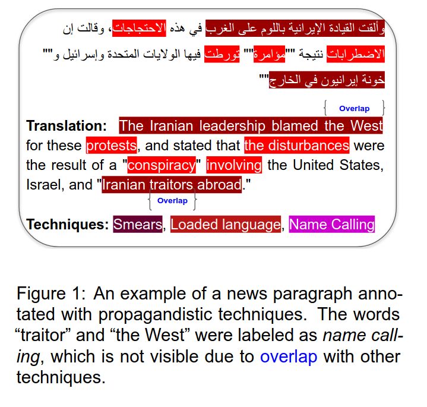
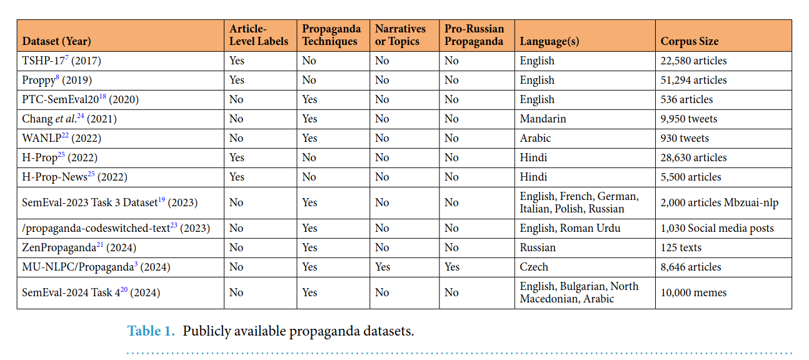
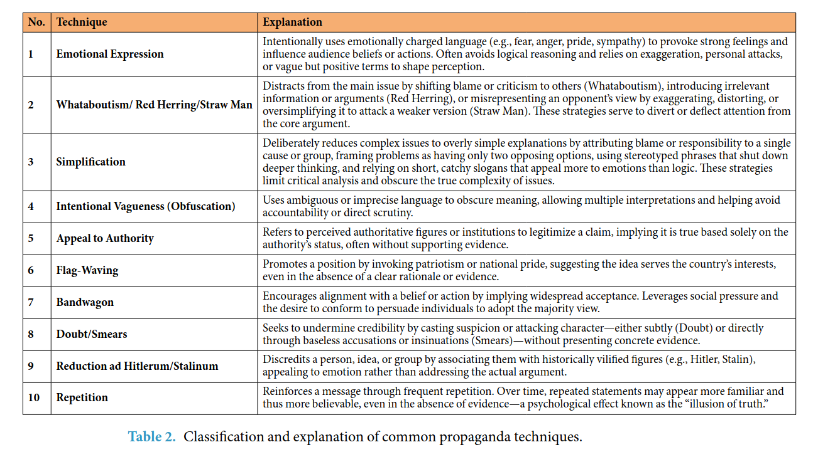

## Initial Roam

### lib to get the news articles (basically from any source)
https://newspaper.readthedocs.io/en/latest/

### site to find papers / datasets in open source
https://zenodo.org/search?q=h-prop&l=list&p=1&s=10&sort=bestmatch

### another example  

### discussion: how should we separate spans + labels
um approach que vi em novos artigos era de:
1. passar o artigo completo ou um parágrafo inteiro (não sentença)
2. fazer uma classificação multi-label multi-classe

mas esse approach é muito custoso, pois llms anotando podem anunciar os spans (inicio / fim texto), além de que um modelo que faça isso geralmente não alcança resultados tão bons.  

O approach que utilizei no MVP foi de:
1. tratar o texto do artigo em sentenças (não parágrafos) através de spacy
2. fazer labelling através da sentença, sem necessidade de spans

é mais seguro, mas o problema com esse approach é que uma sentença pode não estar completa e não fazer tanto sentido.  

## Artigo: HALT-PROP: Human-Annotated Lithuanian Textual Corpus for Propaganda Narratives and Techniques

https://www.nature.com/articles/s41597-025-06367-w  

### publicly available propaganda datasets

### labels / explanation

## Artigo: Can GPT-4 detect propaganda

https://aclanthology.org/2024.lrec-main.244.pdf

### pre-trained models
| [...] "we used the transformer toolkit (Wolf et al., 2020) to fine-tune the models. Following the approach of Devlin et al. (2019), we fine-tuned each model using default settings over five epochs. We conducted five reruns for each experiment with different random seeds, and report the average performance over the reruns on the test subset.

### evaluation
| We computed both macro-averaged and micro-averaged F1 scores to evaluate the models’ performance. These measures have been frequently used in previous studies when reporting on the performance of propaganda detection tasks (Dimitrovet al., 2021a). Since the span-level task is a multilabel sequence tagging task, it is evaluated using a modified F1 measure that accounts for partial matching between the spans across the gold labels and the predictions (Alam et al., 2022b).

they used zero-shot gpt-4

### discussão
existem alguns artigos focando em detecção de propaganda e discurso, mas poucos focam no multimodal, como é o exemplo dos memes (Dimitrov et al., 2021b). Focar nesse assunto seria um diferencial nosso, não apenas tratando o áudio, mas também focando no visual. Um exemplo de utilização seria pegar frames específicos do vídeo, que coincidem com a frase que a pessoa ta falando, e, através da descrição visual do que se vê, incorporar no modelo aquela informação. Pode ficar como melhorias futuras, além da identificação de sarcasmo e tom de piada.

## Artigo: Fine-Grained Analysis of Propaganda in News Articles

https://aclanthology.org/D19-1565.pdf (2019, 33 citações)

Determina as labels que iremos utilizar.

1. Loaded language
2. Name calling or labeling
3. Repetition
4. Exaggeration or minimization
5. Doubt
6. Appeal to fear/prejudice
7. Flag-waving
8. Causal oversimplification
9. Slogans
10. Appeal to authority
11. Black-and-white fallacy, dictatorship
12. Thought-terminating
13. Whataboutism
14. Reductio ad Hitlerum
15. Red herring
16. Bandwagon
17. Obfuscation, intentional vagueness, confusion
18. Straw man.
