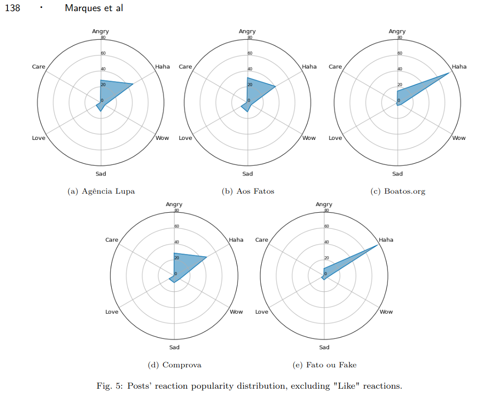
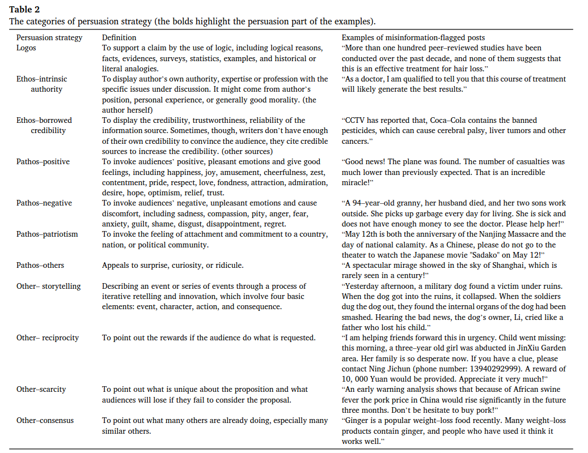
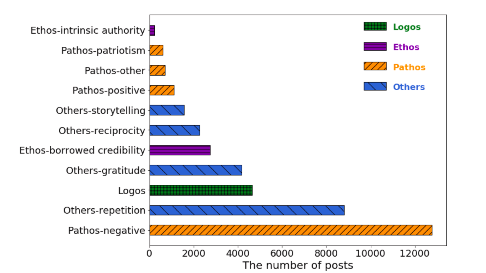

## Artigo: A Comprehensive Dataset of Brazilian Fact-Checking Stories

https://journals-sol.sbc.org.br/index.php/jidm/article/view/2354/1982

"""  
Automatic misinformation detection. A frequent challenge in the context of misinformationprevention is the scarcity of data labeled by recognized entities. Our repository might be used toidentify instances of misinformation in several suspicious sources. These instances can then be utilizedin the training of machine learning algorithms that attempt to identify characteristics and distributionsthat might be associated with this kind of content. These machine learning models can then be utilizedfor the automatic detection of misinformation content and the development of tools to assist journalistsand fact-checking agencies in debunking misinformation.
"""

`in/central_de_fatos.csv`

Review: não gostei do dataset, apenas mostra os textos dos fact checkers. Para o nosso caso o texto classificado original também é importante

---

https://github.com/Interfaces-UFSCAR/Dataset-FactPolCheckBr/tree/main  

Review: mesma coisa do anterior

---

https://www.kaggle.com/datasets/mdepak/fakenewsnet?resource=download&select=PolitiFact_fake_news_content.csv

---

## Artigo: Persuasion strategies of misinformation-containing posts in the social media

PRECISO ACHAR OS DADOS DESSE

https://doi.org/10.1016/j.ipm.2021.102665
- enviar email pedindo

---
O outro é o SemEval-3 2023
PEDI ACESSO
